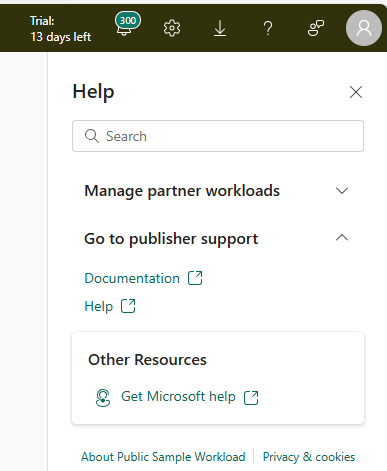

This document describes the schema, basic functionalities and examples of a workload's Frontend manifests.

## *Product* manifest ##
This manifest outlines the core attributes of the Workload Fabric Product, such as name, display name, icons, support Links, and Branding Information: These elements define the workload's identity and appearance. Additionally, we'll explore the Create Experience property, which offers different ways to create new items along with associated actions.

* Create Experience: Describes the looks and experience for creating new items that the workload provides. In our Sample workload, there's a single Create card. When clicked, it triggers the action `open.createSampleWorkload`, which opens the Sample UI.
```
    "createExperience": {
      "cards": [ // Multiple cards can be utilized, each triggering an action to create another type of item.
        {
          "title": "Sample Item",
          "description": "Create a Sample Workload Item for your Dev Experience",
          "icon": {
            "name": "assets/dial.svg" // The Path to the card icon. An asset with the same name should exist in the assets folder.
          },
          "icon_small": {
            "name": "assets/dial.svg" // The Path to the card small icon. An asset with the same name should exist in the assets folder.
          },
          "onClick": {
            "action": "open.createSampleWorkload" // The action that Fabric will send to your workload when the user clicks on the card.
          },
          "availableIn": [ // The workload can specify where in the Fabric portal users will be able to see this card.
            "home",
            "create-hub",
            "workspace-plus-new",
            "workspace-plus-new-teams"
          ]
        },
   ```

* Product Details: Provides the information needed for the workload details page. (See below image)
```
    "productDetail": {
      "publisher": "Contoso", // The publisher display name. See 4 in image below
      "slogan": "The quickest way from a billion points of data to a point of view.", // The workload slogan. See 2 in image below
      "description": "Contoso workload enables org..", // Workload long description. See 5 in image below 
      "image": { // Workload banner image. See 1 in image below 
        "mediaType": 0,
        "source": "assets/BannerMedium.png"
       },
      "slideMedia": [ // Workload screenshots which provide a visual preview of your workload. See 6 in image below 
        {
          "mediaType": 0,
          "source": "assets/SampleWorkload1.png"
        },
        {
          "mediaType": 0,
          "source": "assets/SampleWorkload2.png"
        }
      ],
        "supportLink": {
          "documentation": {"url": "https://example.com/documentation"},
          "certification": {"url": "https://example.com/certification"},
          "help": {"url": "https://example.com/help"},
          "privacy": {"url": "https://example.com/privacy"},
          "terms": {"url": "https://example.com/terms"},
          "license": {"url": "https://example.com/license"} // Link to the workload SaaS offer
      } // Your workload links including documantion, help, privacy, etc..
    },
    "compatibleItemTypes" : ["Lakehouse"] // Built in item types which you workload is compatible with. See 3 in  image below 
   ```

Product details page:


## Help pane ##
The help pane provides access to support resources for third party workloads. It includes a path to 3P workload documentation and customer support pages provided by Isv's in prouct details section.



## *Item* manifest ##
This manifest outlines the core attributes and configuration of the Workload Fabric Items, such as name, display name, icons, available actions, etc.
The workload needs to define a separate JSON file for each of its items.

```
{
    "name": "SampleWorkloadItem", // The item type name must match the name in the ItemManifest.xml, without the workload name prefix. e.g 'Org.WorkloadSample.SampleWorkloadItem' --> 'SampleWorkloadItem'.
    "displayName": "Sample Workload Item", // The item display name that users will see in Fabric.
    "displayNamePlural": "Sample Workload Items",
    "editor": {
      "path": "/sample-workload-editor" // Item editor path, as registered in App.ts.
    },
    "icon": {
      "name": "assets/execute.svg" // The Path to the item icon. An asset with the same name should exist in the assets folder.
    },
    "activeIcon": {
      "name": "assets/execute.svg" // The Path to the item active icon. An asset with the same name should exist in the assets folder.
    },
    "contextMenuItems": [ // Item actions available from the ellipsis (...) next to an item in the workspace view
      {
        "name": "SampleItemCustomAction", // The item action name
        "displayName": "Run calculate job", // Text to be displayed next to the item action button
        "icon": {
          "name": "assets/execute.svg" // The Path to the item action icon. An asset with the same name should exist in the assets folder.
        },
        "handler": {
          "action": "run.calculate.job" // The action that Fabric will send to your workload when the user clicks on the context menu item.
        },
        "tooltip": "Adding a custom button to the item context menu" // Tooltip text user will see when he hovers over the item action
      }
    ],
    "quickActionItems": [ // Actions visible next to the item in workspace view
      {
	/// same syntax as contextMenuItems
      }
    ],
    "SupportedInMonitoringHub": true,
    "supportedInDatahubL1": true
```

Manifest schemas are located in [Validation](./validation).

The sample workload manifests are located in [Package](./Package).

More advanced manifest configurations, specifically related to [jobs and monitoring hub](../MonitoringHub.md) and [authentication setup](../Authentication/Setup.md), are covered in a dedicated documentation.
