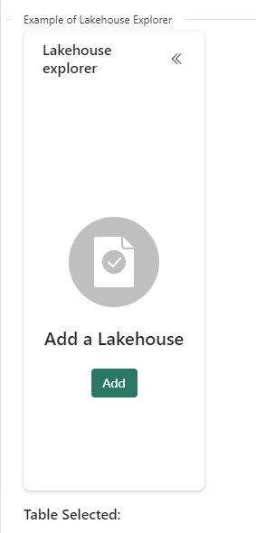
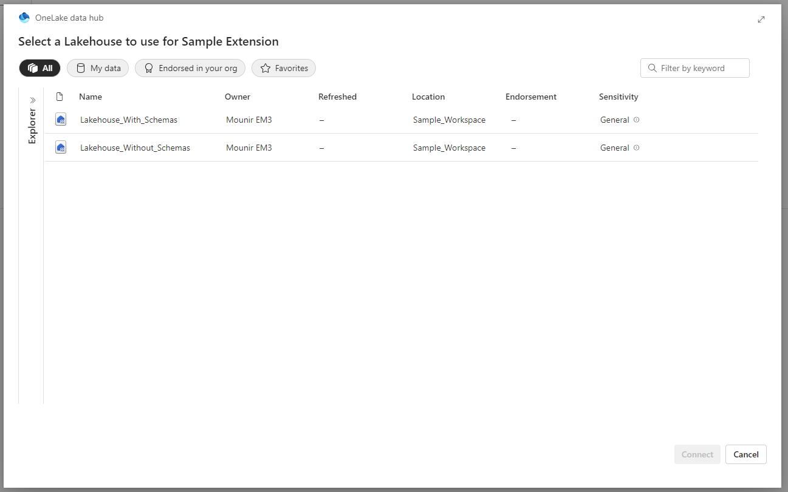
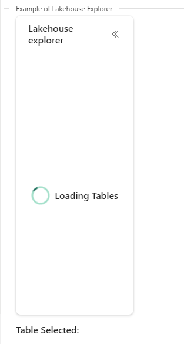
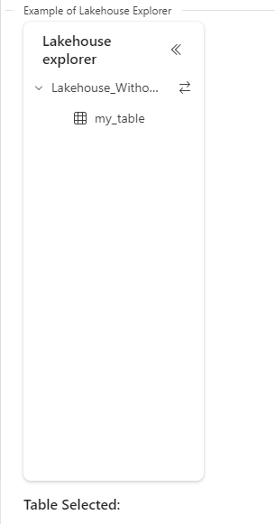
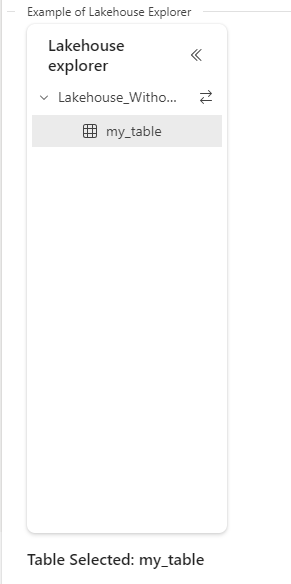

# Lakehouse Explorer Component #
In addition to FluentUI controls, the Sample Extension provides a Sample Lakehouse Explorer component under the "FluentUI Playground" tab.

The Lakehouse Explorer component allows the user to select a Lakehouse from any of the Lakehouses they have access to using the Datahub API. The table data is fetched using the Storage Services API, and the component then displays the tables that are available in the selected Lakehouse. The user can then interact with the component and select their desired table.

### Potential Use Cases ###
The Lakehouse Explorer and the functionality it provides can be used to access and manipulate the contents of a Lakehouse, such as viewing tables, adding tables, editing existing tables, and more.

### UI Experience ###
First, in our sample item, we navigate to the FluentUI Playground tab to see the Lakehouse Explorer Component:



We click on "Add" to choose our Lakehouse, prompting the Onelake Data Hub dialog to appear:



Here, we see all the Lakehouse artifacts that we have access to. Note, that the Lakehouse can be in a different workspace than your artifact.

After selecting a Lakehouse, the tables are loaded and can be selected in the UI.





The UI is updated to reflect that 'my_table' is selected.

## Frontend ##
The implementation of the Lakehouse Explorer can be found here : [Lakehouse Explorer Component](./Frontend/src/components/SampleWorkloadLakehouseExplorer)

First, we'll address the need for two different tree components, one to handle Lakehouses that have a schema and one to handle Lakehouses that don't have a schema.

**What is a schema**? A schema is an upcoming feature of the Lakehouse artifact that allows us to organize tables. New Lakehouses will, in the future, be created with a default schema "dbo". The user will be able to add other schemas and create tables under them.

Old Lakehouses will retain their structure and will not have the schema property.

In the above sample flow, we chose an "old" Lakehouse that doesn't have a schema. For reference, this is the structure of a Lakehouse with the schemas property:


### Step 1: Open the datahub selector dialog ###

We use the Datahub API in the SampleWorkloadController to open a dialog containing the Onelake data hub with the available Lakehouses. When a Lakehouse is selected we receive a response of the type **DatahubSelectorDialogResult**.

We extract the following information regarding the selected Lakehouse from the response:

```json
{
        id: artifactObjectId,
        workspaceId: workspaceObjectId,
        type: "Lakehouse",
        displayName,
        description
}
```

This information will serve us in Step 2.


### Step 2: Send a request to the backend to fetch table data from Onelake ###
When a Lakehouse is selected, the following function is called:

```typescript
    async function setTables(additionalScopesToConsent: string) {
        let accessToken = await callAuthAcquireAccessToken(extensionClient, additionalScopesToConsent);
        const tablePath = getTablesInLakehousePath(sampleWorkloadBEUrl, selectedLakehouse.workspaceId, selectedLakehouse.id);
        let tables = await getTablesInLakehouse(tablePath, accessToken.token);
        setTablesInLakehouse(tables);
        setHasSchema(tables[0]?.schema != null);
    }
```
This function:
1. Acquires an access token which will be passed in the "Authorization" header to the Backend, which is required for data access.
2. Fetches the tables in the Lakehouse using getTablesInLakehouse.
3. Sets the schema indicator and the tables to be displayed in the component. The schema indicator determines which tree component to render.

Please reference the [Lakehouse Explorer Controller](Frontend/src/controller/LakehouseExplorerController.ts)

## Backend ##

The following Backend code is required in order to communicate with Azure Storage services and retrieve the tables metadata. Overall, the Backend receives a client token from the Frontend, uses this to acquire a token OBO for the necessary scopes, uses the OBO token to send a Get request to OneLake to the directory containing the desired tables, and finally returns a list of table names and their corresponding paths to the Frontend for display in the Lakehouse Explorer.

### Step 1: Acquire Access Token On Behalf Of ###
First, we'll look at the LakehouseController.

The request from the Frontend is handled by **[GetTablesAsync](Backend/src/Controllers/LakeHouseController.cs#L86)**.

This function:
1. Creates an authorization context and gets a token on behalf of the user using the bearer token passed from the Frontend 
2. Uses the LakehouseClientService to call **GetOneLakeTables**, which returns a list of type LakehouseTable in the Lakehouse.

### Step 2: Fetch the paths of the desired tables with GetOneLakeTables ###
Now, we'll look at the LakehouseClientService.

**[GetOneLakeTables](Backend/src/Services/LakeHouseClientService.cs#L247)** does the following:
1. Gets a list of paths for objects in the Lakehouse (GetPathList)
2. Filters out the desired paths.
3. Converts each path into an object of type LakehouseTable, which includes the name of the table, the path, and whether or not the table is part of a schema:

```Csharp
{
        public class LakehouseTable
    {
        public string Name { get; init; }

        public string Path { get; init; }

        public string Schema { get; init; }
    }
}
```

In order to get the list of paths, we use the following REST API provided by Storage Services : [Path API](https://learn.microsoft.com/en-us/rest/api/storageservices/datalakestoragegen2/path/list?view=rest-storageservices-datalakestoragegen2-2019-12-12)
Note that for OneLake calls, the `directory` param is required, and should match the Lakehouse ID.
For more information on OneLake integration with ADLS (Azure Data Lake Storage), see [OneLake Integration](https://learn.microsoft.com/en-us/fabric/onelake/onelake-api-parity#managed-onelake-folders).)

For more Storage Service REST APIs see: [All REST APIs](https://learn.microsoft.com/en-us/rest/api/storageservices/data-lake-storage-gen2?view=rest-storageservices-datalakestoragegen2-2019-12-12)

### Step 3: Return a list of LakehouseTables ###

We passed recursive=true to the function GetPathList. This, due to the fact that there are two different types of Lakehouses, as explained in the Frontend section.
Lakehouses without schemas have the following path structure: ``` <lakehouseId>/Tables/<tableName> ```, so the table names can be found without recursion as direct descendants of the directory.

However, Lakehouses with schemas have the following path struture ```<lakehouseId>/Tables/<schemaName>/<tableName>``` and thus in order to find the table names, we must recursively search *each schema*.

The path list contains several paths per table. We select the paths that end in _delta_log, because Fabric tables are saved as delta tables, and thus each table has a '_delta_log' folder that will be represented by a path. In this way, we ensure we're selecting only paths that correspond to tables.

From the path, we extract the table name and the schema, if available, and return a list of LakehouseTables.

The names of the tables can now be used in conjunction with [Fabric Table REST APIs](https://learn.microsoft.com/en-us/rest/api/fabric/lakehouse/tables) to load the tables themselves.

