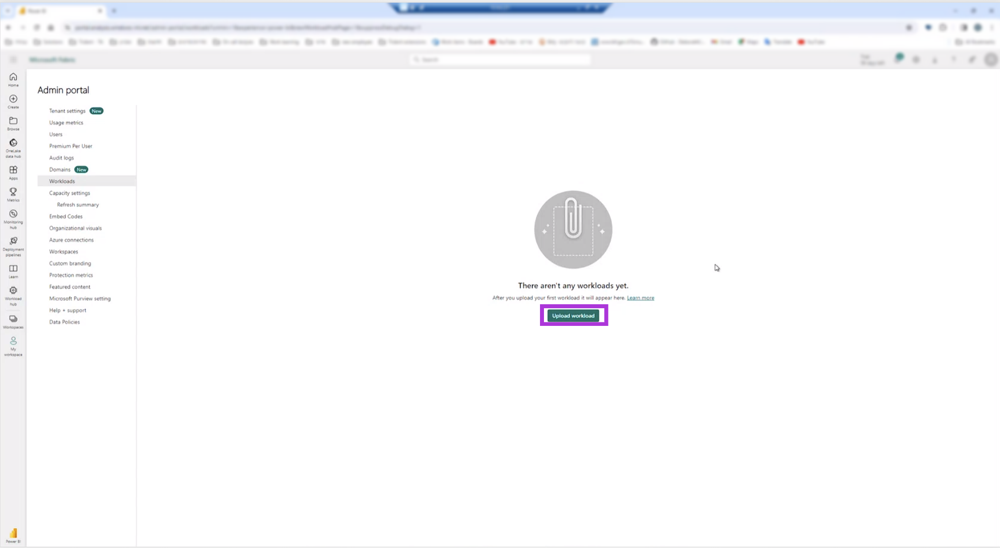
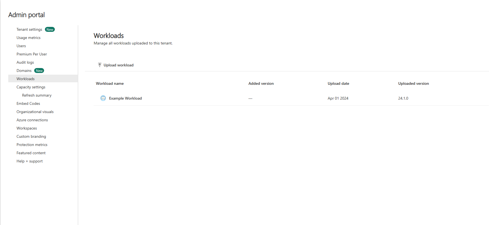

# Microsoft Fabric Workload Upload and Test Guide

## Introduction
This document provides a comprehensive guide on testing workloads in full cloud mode (BE and FE running on the fabric tenant). Follow the steps below to leverage the features of Microsoft Fabric effectively.

## Prerequisites
- Customized workload based on the developer sample ready for upload with BE and FE updated - https://github.com/microsoft/Microsoft-Fabric-developer-sample
- Non production Fabric tenant
- Fabric Admin user


## Step-by-Step Guide

<!-- 1. **Clone the Sample Repository**
   Begin by cloning the Microsoft Fabric developer sample from the GitHub repository:
   ```
   git clone https://github.com/microsoft/Microsoft-Fabric-developer-sample
   ``` -->

<!-- 2. **Customize Your ISV Workload**
   Customize and develop your ISV workload to meet your specific needs. -->

1. **Build the Solution** 
   
   Build your solution in release mode. This will create a NuGet package encapsulating your standalone workload with both frontend (FE) and backend (BE) components.
   In Visual Studio with the workload solution loaded, build the solution in release mode. Note, before building solution, make sure your workload files are up-to-date, FE and BE. This will create a workload nuget package.
   
   ##### Release mode:
   
   
   ##### Build Solution:

   

   Once the build is completed, the workload nuget package can be found in the workload repo under \Backend\src\bin\Release folder

<!-- 4. **Download NuGet CLI**
   Ensure you have the NuGet CLI tool by downloading it from the official NuGet website.

5. **Package Your Workload**
   Use the NuGet CLI to package your workload:
   ```
   nuget pack <path-to-your-csproj-file>
   ``` -->

2. **Upload to Fabric Tenant**
   To upload the workload package, login to the Fabric tenant (uploading a workload requires a Fabric tenant admin to be logged in) navigate to the admin portal. Go to the workloads section and select the option to upload a new workload.

   ##### Upload workload
   
   ##### Browse local machine
   
   ##### Workload uploaded
   


3. **Activate the Workload**
   Once uploaded, select the new workload from the list to access the settings.
   The settings allows the tenant admin to set the selected workload version to the tenant. Choose the desired workload version (as defined in the workload manifest) from the dropdown menu and activate it for your tenant by clicking Add.

   ##### Activate workload on tenant
   
   ##### Workload active in tenant
   

   #### Note
   - When a version has previously been activated in the tenant, it will be indicated in the workload settings.
   - The activated workload version can be edited, to change the active version in the tenant, or deactivated, meaning the workload will not be active in the tenant.
   - In addition to setting the workload version in the tenant, the workload settings lists all uploaded workload packages in the "Uploads" tab:
   ##### Upload tab in workload settings
   

4. **Test the Workload**
   The workload is now active and running within the tenant. You can interact with it and perform necessary tests to ensure functionality. Notice the workload status is now update, and is displayed as "Active in tenant" in the status column. Additionally the workload version is listed in the "Version" column.

## Conclusion
By following these steps, workloads can be tested on Fabric tenants.
Please note that this covers the full cloud mode running a development workload on a Fabric tenant, for information on local mode (loading a workload from a local machine) see [Backend Workload Configuration Guide](Backend/README.md), in addition for more information of workload deployment in Azure see [Workload Deployment Setup](WorkloadDeploymentSetup.md).
