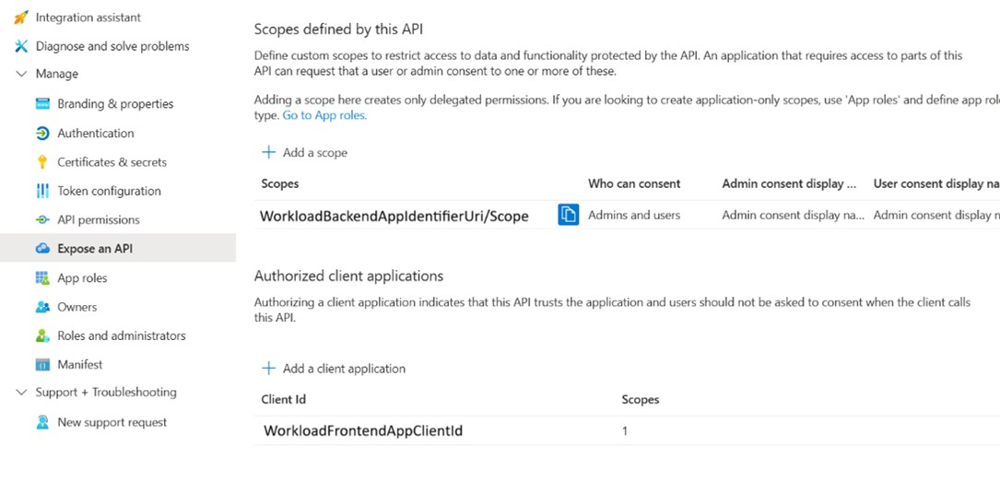
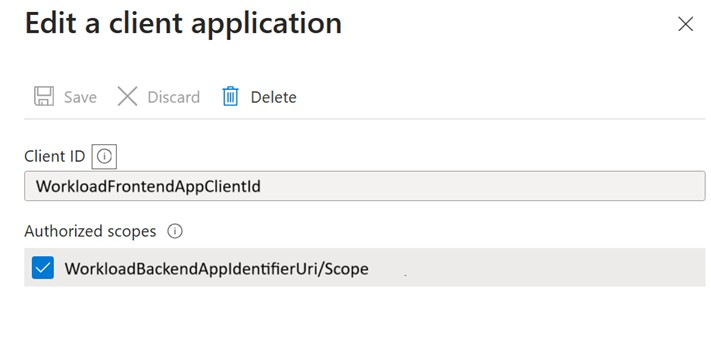
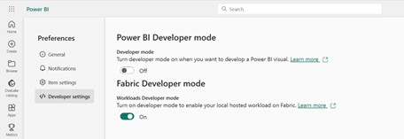
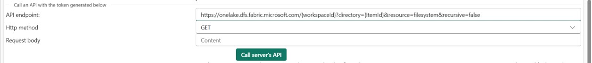

# Setup Guide

In this section we will present all necessary steps to get started. 

## Frontend Authentication
To start using the Frontend authentication you need to perform certain steps.

### Register a Frontend Entra Application:
The first step is to create a Frontend Entra Application that you can use in order to access the Fabric APIs. 
1. Navigate to App registrations in the Azure Portal.
2.	Create new Multitenant application .
 
3.	Add the following SPA redirectURIs to the application manifest:
a.	“https://app.fabric.microsoft.com/workloadSignIn/{publisherTenantId}/{workloadId}”
b.	“https://app.powerbi.com/workloadSignIn/{publisherTenantId}/{workloadId}”
c.	“https://msit.powerbi.com/workloadSignIn/{publisherTenantId}/{workloadId}”

## Workload BE Preauthorization (optional):
If the workload frontend app is going to generate tokens targeting the workload backend app, the workload frontend app must be preauthorized by the workload backend app with the relevant scopes.
1.	Navigate to App registrations in the Azure Portal.
2.	Navigate to the Workload Backend app registration.
3.	Navigate to “Expose an API”.
4.	Click “Add a scope” to add a new scope that will be targeted in the workload frontend token request.
5.	Click “Add a client application”, insert the Client Id of the workload frontend app registration, and select the new scope from the previous stage to preauthorize the Workload Frontend Application with this scope.  

 

 
 
Configure the Workload Sample:
The next step is to configure your workload to make use of the new Frontend App. For this you can either clone the newly provided Workload sample that also contains code to demonstrate how to call the public APIs. Another way is to use your already existing Workload and make the changes manually 
Clone new Workload Sample (optional):
1.	Clone the Microsoft-Fabric-workload-development-sample
2.	Checkout the “dev/dbrailovsky/wld_fe_auth_api” branch

## Configure your Workload to use the Frontend App: 
1.	Open the “.env.dev” file and insert your workload name in the “WORKLOAD_NAME” configuration property and your frontend application client id in the “DEV_AAD_FE_CONFIG_APPID” configuration property.
2.	npm install

### Change the Workload Manifest:
1.	Open the “WorkloadManifest.xml”
2.	Make sure the  workload manifest “schemaVersion” is “2.000.0”.
3.	Make sure the HostingType is “FERemote”
4.	Under the “CloudServiceConfiguration”, add an “AADFEApp” element with an “AppId” of the workload frontend Entra application.
 
### Test the Frontend Application:
After you have completed all the steps you are ready to test the workload. 
Start the workload in Development mode: 
1.	Run npm start in the Frontend folder
2.	Navigate to the Fabric portal
3.	Enable the workload developer mode flag
4.	Start the Development Gateway
5.	Start the Backend (this is needed for the Item CRUD flow and if you have some backend business logic that you want to connect to)

### Test the workload: 
If you have cloned the private repository before, you are ready to go with an example available on how to use the FE Token to access the APIs. For this navigate to 
1.	Navigate to the Fabric Admin Portal end enable the following tenant settings:
  
2.	Navigate to the Fabric Developer Settings and enable the Fabric Developer Mode:
   
3.	Refresh the browser.
4.	Navigate to https://app.fabric.microsoft.com/workloads/<WORKLOAD_NAME>/client-sdk-playground?fabricExtensibility_ClientSideAuth=1
(append fabricExtensibility_ClientSideAuth=1 to url in order to enable ClientAuthentication API in PrivatePreview)
5.	Open the “Frontend Authentication (Private-Preview)” tab
6.	To acquire token for OneLake, request for the “https://storage.azure.com/user_impersonation” scope.

  
 
7.	After successfully acquiring the token, it can be used to target one OneLake APIs, for example, to retrieve the list of folders created for a certain item in OneLake use the following API – GET https://onelake.dfs.fabric.microsoft.com/{workspaceId}?directory={ItemId}&resource=filesystem&recursive=false
 
  
